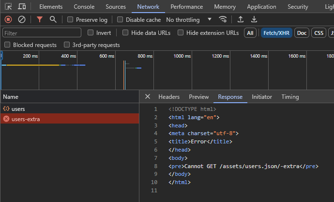

## How to reproduce the error

1. `npm run reproduce`
2. Open http://localhost:4200 in the browser.
3. Click "get users" button: everything should be OK ✅.
4. Click "get extra users" button: you should see a proxy redirection error in the devtools network panel ❌

## A workaround

This workaround consists of changing the order of Angular proxy configurations JSON properties in the proxy configuration file.

1. `npm run workaround`
2. Open http://localhost:4200 in the browser.
3. Click "get users" button: everything should be OK ✅.
4. Click "get extra users" button: everything should be OK ✅.

## One possible solution

Having the order of definition of the properties in the proxy configuration file define the redirection to be done by the Angular proxy does not seem to me to be the best solution (see the workaround above). In my opinion, the definition of the proxy settings should be independent of each other and not depend on what order they are defined in to work correctly.

A possible solution could be to change the way in which the URLs to be replaced are defined: instead of using a wildcard `".../*"` at the end, replace it with `".../**/*"`, so that the replacement is more specific.

1. `npm run solution`
2. Open http://localhost:4200 in the browser.
3. Click "get users" button: everything should be OK ✅.
4. Click "get extra users" button: everything should be OK ✅.